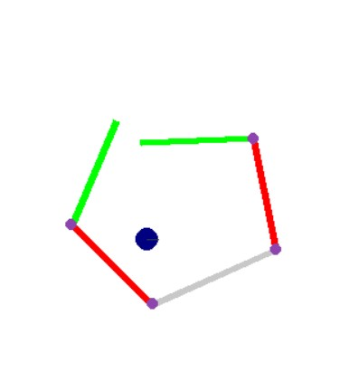

# CLAW robot physics simulation using Python

- This is a python GUI that simulates the movement of the CLAW robot in water(sea), taking into account drift, inertia, mass, rotational inertia, friction, impulse, collisions, and many other physical parameters.
- A reinforcement learning model has also been trained such that the robot can adjust the angles between its arms to reach the target value
- I made this GUI during my PS1 internship @ Sentient labs as a testing environment for automated movement, before deploying on the real product
 
 

## Packages used
-  **Pygame** 
        (For GUI)
-  **Pymunk**
        (For Physics simulation)
-  **Tensorflow**
        (For reinforcement learning)
-  **Numpy**
        (For matrix calculations)

## Installation
Open the terminal(Mac/Linux)/Command prompt(Windows), make sure you have already installed Python>=3.5 on your system
- **Make a new virtual environment**    
    `python -m venv CLAW_sim`  

    `cd CLAW_sim`  

    `Scripts\activate`  

    `python -m pip install -–upgrade pip`
- **Clone repository**  

    `git clone https://github.com/gpsub/CLAW_physics_simulation_using_python.git`
- **Install packages**  

    `pip install tensorflow pymunk pygame`

## How to run
- **Go to folder**  
    `cd CLAW_sim`  

    `Scripts\activate` (to activate virtual environment)  
    
    `cd CLAW_physics_simulation_using_python\mod_code`
- **To run physics simulation**:     
    `python physics_env_main.py`  

    **Controls**: 
    - **W,S** key-> leftmost arm up/down
    - **A,D** key-> second left arm up/down  
    - **Up/Down** arrow key -> Rightmost arm up/down
    - **Left/right** arrow key -> second right arm up/down
    - **U,H,J,K** -> Move entire robot. U: Move forward J: Move back H: Rotate left K: Rotate right.
    
        **Pro tip**: Press U/ J quickly 5-6 times to make it go really fast  
    - **R** -> Reset  
    - **Q/Escape** -> Quit

    The blue circle represents a ball which is floating in the water, you can interact with it by moving the robot arms/body.
- **To run reinforcement learning code**:  

    `python rl_first_version\main.py`  

    It will begin the training process of the model, it will settle to the target "angles between arms" (array of 4 values) which has been already set in the program after a few minutes.  

    The model is learning to incrementally rotate its arms so that it can reach the target "angles between arms"  which has been set by the user. Once the model is trained, the robot will be able to rotate its arms to reach any angle passed by the user.  
